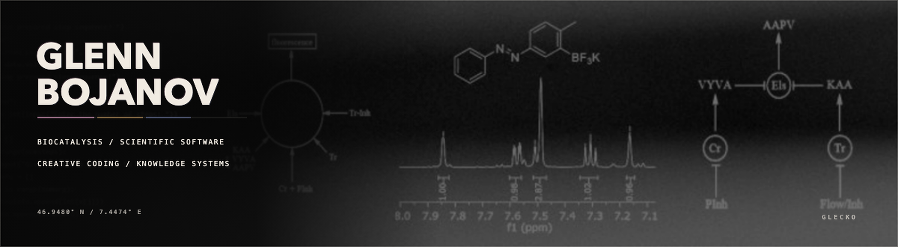

  

I work in biocatalysis, scientific software, creative coding, and knowledge systems.

Across laboratory analysis, audio DSP, and Obsidian automation, most of my code starts with a real point of friction and becomes a tool I want to use myself.

  
  
  
  

## Biocatalysis

My PhD work is in enzyme discovery, enzyme immobilization, and flow biocatalysis.

## Scientific software

- **[ChemDraw MCP for macOS](https://github.com/glebo309/chemdraw-mcp-macos):** native, editable chemical drawings from a terminal or MCP client
- **GeckoPlotter:** HPLC and LC-MS analysis
- **DarkzymeScope** *(manuscript in preparation)*
- **[Bayesian Reaction Optimizer](https://github.com/glebo309/bayesian-reaction-optimizer):** choosing useful experiments from limited data

GeckoPlotter and DarkzymeScope will appear here when they are ready for public release.

## Creative coding

I build Max/MSP and Max for Live instruments under Glecko. **[285](https://glecko.xyz/285/)** is playable in the browser.

<strong>Max for Live devices</strong>

### Instruments

- **ALTER:** a five-voice polyphonic drone instrument with scale quantization and a full modulation mesh
- **MAZE:** a playable dual-oscillator voice with wavefolding, parallel filtering, cross-modulation, and generative sources
- **DFAM27:** a percussion synthesizer combining a DFAM-style core with wavefolding, cross-FM, a low-pass gate, external audio, and a large modulation matrix
- **RAM:** a bass-drum synthesizer built around the Shakmat Battering Ram architecture
- **ADX:** three linked percussion voices for metal, hats, and snare, with open and closed articulation
- **ARCHER:** a digital-noise and analog-chain percussion instrument with thirteen sources, nine effects, and per-hit variation
- **PULSAR23-BD:** a PULSAR-23 bass-drum voice with the WTF and OMG performance functions, modulation, and MIDI control
- **HATS:** a synthesized hi-hat voice built from metallic oscillator clusters, noise, filtering, wavefolding, and open or closed envelopes
- **PLAITS:** a focused Max for Live interface around the Mutable Instruments Plaits engine
- **NOISE:** a private generative texture instrument that morphs between four evolving sound engines

### Effects

- **EXPAND:** a stereo saturation and bus-shaping processor inspired by the Overstayer NT-02A signal architecture
- **TORSO-RING:** a morphing stereo bank of forty-eight tuned resonators with sidechain and modulation systems
- **RINGS:** a Max for Live interface around the Mutable Instruments Rings resonator
- **FILTER:** a multi-model character filter covering ladder, diode, Sallen-Key, state-variable, low-pass gate, and Polivoks-style responses
- **FILTER.DJ:** the same filter family reduced to one bipolar performance control
- **PHASELOCK:** measures and corrects kick and bass alignment using delay, polarity, and continuous phase rotation
- **FEEDBACK SHAPER:** shapes repeated feedback passes with drive, tone, short memory, drift, wow, flutter, and dropouts
- **STRANGE:** a pitch-tracked nonlinear dynamics processor built from forced Duffing and Van der Pol systems
- **COUNTER:** extracts and sustains combination tones from incoming pitched material
- **SMEAR:** a period-aligned granular effect that pulls pitch-coherent fragments from the recent past
- **MORPH:** an earlier spectral resonator-bank experiment that led to TORSO-RING

### Sequencing, modulation, and routing

- **285:** a sixty-four-step sequencer with independent lanes, probability, conditions, controlled corruption, snapshots, and external modulation
- **CHANCE:** a MIDI probability gate whose value can be changed on every step
- **LFO:** one modulation source mapped independently to eight Live parameters, either shared or phase-scattered
- **OVERPASS:** routes Analog Rytm controls and decoded parameter-lock lanes into Live parameters or OSC
- **BETTERBRIDGE:** maps Overbridge parameters into multiple Live destinations with shaping and per-route behavior
- **VOID:** detects the space after a kick and turns that absence into slow modulation envelopes
- **FEEDBACK SEND:** sends an independent stereo copy to a chosen Live routing destination
- **FEEDBACK LISTEN:** receives a feedback path, measures its energy, and exposes that measurement as modulation

## Knowledge systems

My work runs through an Obsidian vault connected to coding agents, retrieval, a knowledge graph, and daily automations. **[claude-setup](https://github.com/glebo309/claude-setup)** contains an earlier portable version of that system.

I also built **[Spotify Transcript](https://github.com/glebo309/spotify-transcript)** to get Spotify's own podcast transcripts into that workflow without retranscribing them.

## Research archive

**[Negative Space](https://github.com/glebo309/negative-space)** is my public archive for smaller research projects from any field, including negative and inconclusive results.

  <a href="https://glecko.xyz">glecko.xyz</a>
  &nbsp;·&nbsp;
  <a href="https://github.com/glebo309?tab=repositories">all repositories</a>

