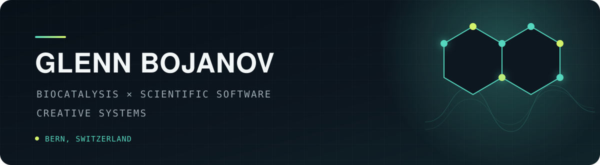

<p align="center">
  
</p>

I am a doctoral researcher in biocatalysis at the University of Bern. I build experimental and computational tools around enzyme discovery, chemical analysis, and reproducible lab work.

Most of my code starts with a real point of friction: drawing editable chemistry, fitting kinetics, parsing instrument data, or making useful information easier to retrieve.

<p>
  
  
  
  
</p>

## Selected work

| Project | What it does |
| :--- | :--- |
| **[ChemDraw MCP for macOS](https://github.com/glebo309/chemdraw-mcp-macos)** | Controls desktop ChemDraw from a terminal or MCP client and produces editable, validated chemical drawings. |
| **[Spotify Transcript](https://github.com/glebo309/spotify-transcript)** | Downloads Spotify's own podcast transcripts as Markdown, text, SRT, or JSON with no AI and no dependencies. |
| **[Bayesian Reaction Optimizer](https://github.com/glebo309/bayesian-reaction-optimizer)** | Uses Gaussian processes and expected improvement to choose informative reaction conditions from limited experiments. |
| **[Scientific analysis tools](https://github.com/glebo309?tab=repositories&q=&type=source&language=python)** | Small, practical tools for enzyme kinetics, experimental design, spectral integration, plasmid management, and protein surface analysis. |

## The thread through it

```text
experiment  ->  structured data  ->  model  ->  useful decision
```

I care about software that stays close to the physical experiment: transparent assumptions, inspectable outputs, and tools a scientist can actually use without rebuilding their workflow around them.

<p align="center">
  <a href="https://glecko.xyz">glecko.xyz</a>
  &nbsp;·&nbsp;
  <a href="https://github.com/glebo309?tab=repositories">all repositories</a>
</p>
